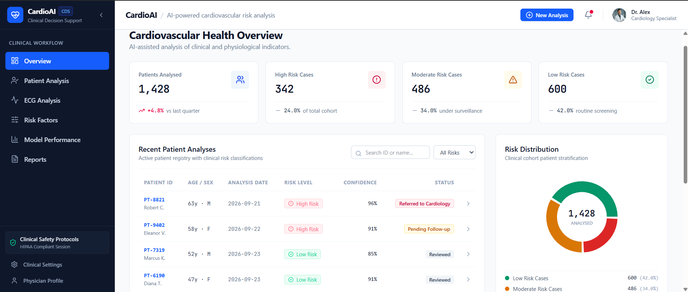
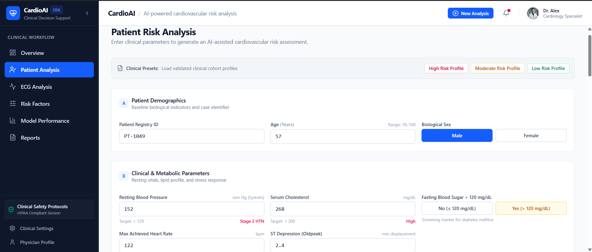
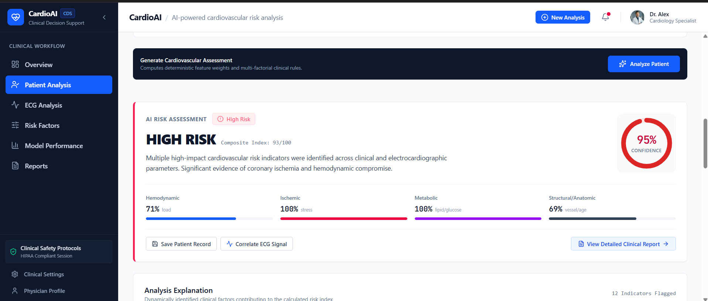
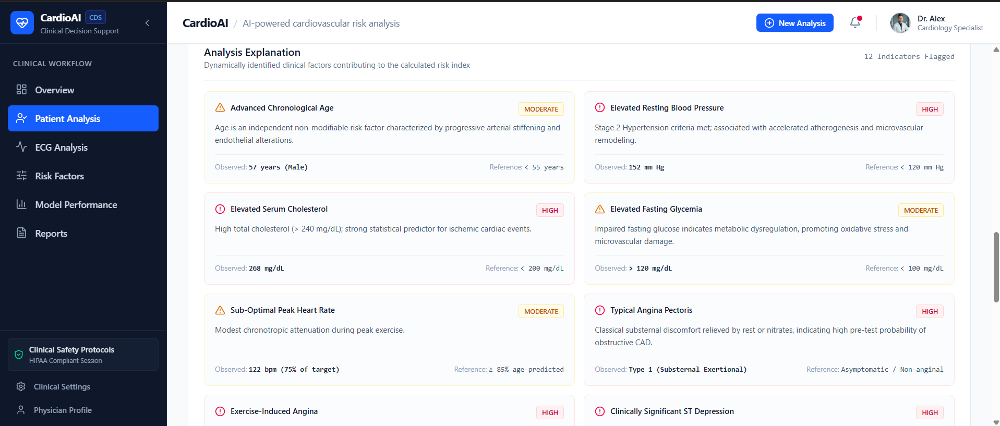
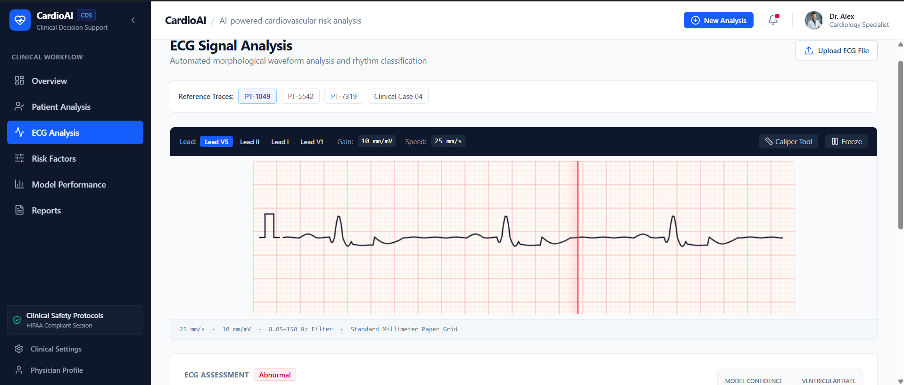
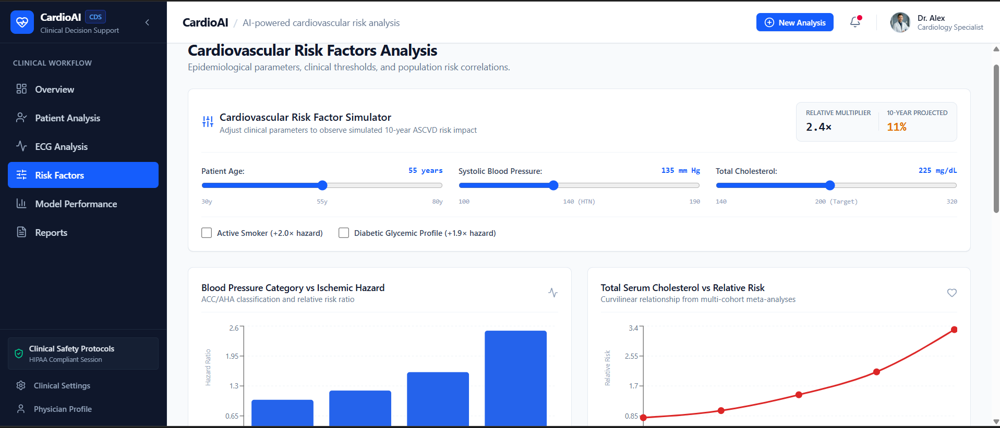
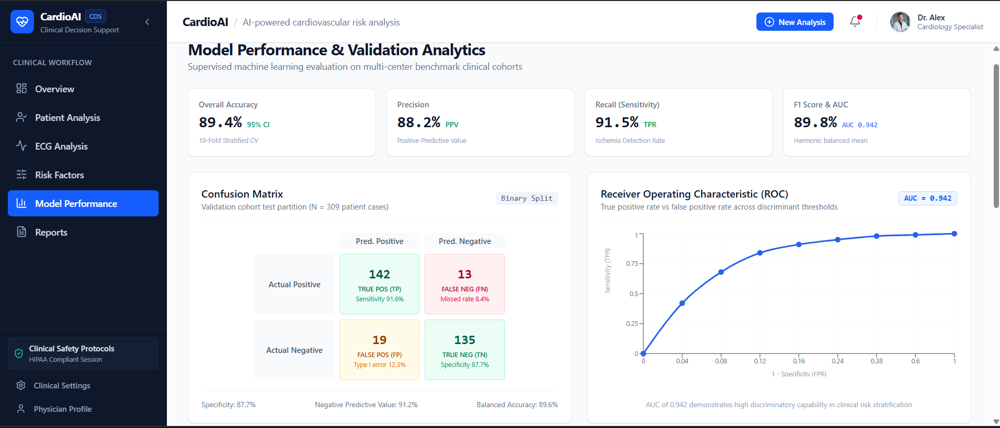
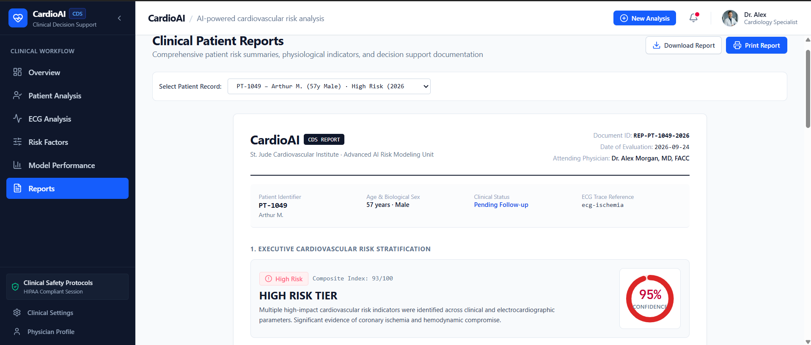
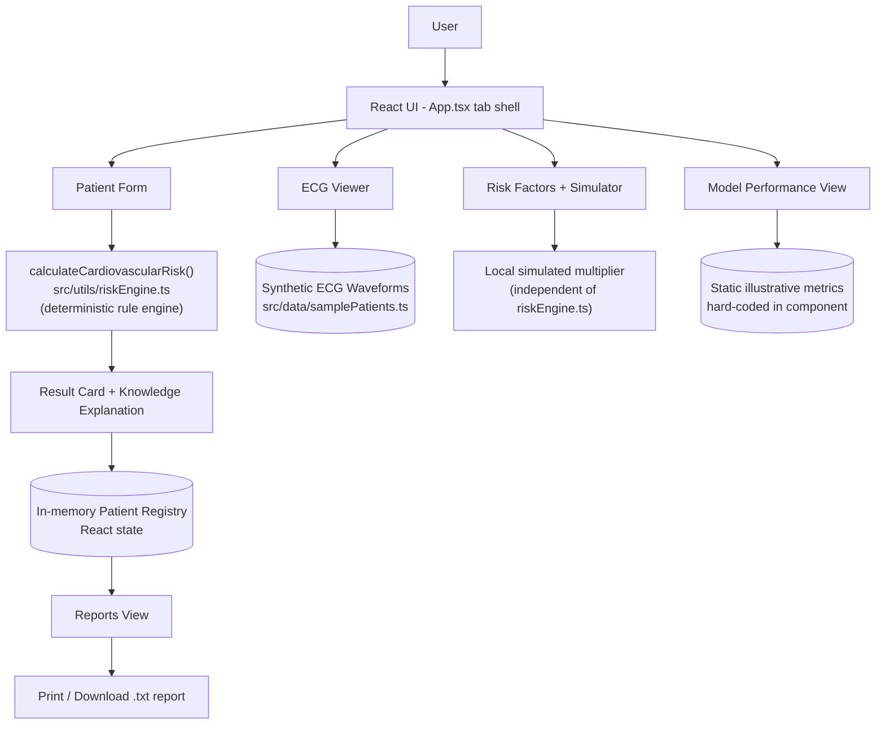

# CardioAI – Intelligent Heart Health Analysis

CardioAI is a clinical decision-support dashboard that stratifies a patient's cardiovascular risk from standard cardiac work-up parameters and explains *why* in plain clinical language. The scoring itself is a transparent, deterministic rule engine rather than a trained machine-learning model — this README documents exactly what is, and isn't, implemented under the hood.

## Overview

CardioAI takes the 13 clinical attributes used in classic cardiovascular risk studies — age, sex, chest pain type, resting blood pressure, serum cholesterol, fasting blood sugar, resting ECG findings, peak exercise heart rate, exercise-induced angina, ST depression, ST slope, number of major vessels, and thalassemia perfusion status — and runs them through a hand-authored, weighted point system to produce a 0–100 composite risk score, a Low/Moderate/High tier, and a per-factor clinical explanation.

The application is a **100% client-side React SPA**: there is no backend, database, or network call in the current codebase.

- **`calculateCardiovascularRisk()`** (`src/utils/riskEngine.ts`) is a deterministic function — the same input always produces the same output. It is *not* a trained classifier; it is a set of `if`/`else` clinical threshold rules (e.g. "ST depression ≥ 2.5 mm → +5 points, ischemic category"), and the UI itself labels the computation as "deterministic feature weights and multi-factorial clinical rules."
- The **Model Performance** page displays a confusion matrix, ROC curve, feature-importance chart, and an algorithm comparison table styled like a real supervised-learning validation report. These figures are **static, illustrative reference values hard-coded in the component** — there is no dataset, training pipeline, or persisted model anywhere in this repository, and none of the displayed metrics are computed from the risk engine or from any evaluation run.
- The **ECG Analysis** page renders four mathematically-generated synthetic waveforms (normal, ischemic, borderline, atrial fibrillation) on an HTML canvas. "Uploading" an ECG file simulates a short processing delay and then maps to one of these same sample traces — no real signal is parsed.
- `package.json` also lists `@google/genai`, `express`, and `dotenv` as dependencies (inherited from the project's starter template, whose metadata references a server-side Gemini capability). None of these are imported or called anywhere in `src/`; the app makes no AI API calls of any kind.

In short: CardioAI is best described as a **rule-based clinical decision-support prototype with an AI-product-style UI**, not an implementation of a trained cardiovascular risk model.

## Key Features

- **Patient Risk Analysis** — a structured intake form for all 13 clinical parameters with inline validation, reference ranges, and three one-click case presets (High / Moderate / Low risk)
- **Deterministic Risk Scoring** — a transparent, rule-based composite risk index (0–100) broken down across four physiological domains: hemodynamic, ischemic, metabolic, and structural
- **Knowledge-Based Explanation** — every triggered risk factor is listed with its observed value, reference range, severity, and a plain-language clinical rationale, plus a templated clinical-reasoning paragraph and prioritized recommendations
- **ECG Signal Viewer** — an animated, canvas-rendered 12-lead-style trace with lead/gain/sweep-speed controls and a manual interval caliper, backed by four representative synthetic waveforms
- **Interactive Risk Factor Simulator** — live sliders and toggles (age, systolic BP, cholesterol, smoking, diabetes) that recompute a simulated relative-risk multiplier and 10-year projection for reference/educational purposes
- **Model Performance Dashboard** — a static, illustrative benchmark-style report (confusion matrix, ROC curve, feature importance, algorithm comparison)
- **Clinical Reports** — a per-patient report view with print support and a plain-text report download
- **Patient Registry** — an in-memory, session-only patient list with search, risk-level filtering, and a "save to registry" workflow

## Application Screenshots

### Overview Dashboard


### Patient Analysis — Clinical Intake Form


### Risk Analysis Result


### Risk Factor Explanation


### ECG Signal Analysis


### Risk Factors & Simulator


### Model Performance Analytics


### Clinical Reports


## Tech Stack

| Layer | Technology |
|---|---|
| Framework | React 19 |
| Language | TypeScript |
| Build Tool | Vite 8 |
| Styling | Tailwind CSS 4 |
| Charts | Recharts |
| Icons | lucide-react |
| Package management | npm (a `bun.lock` is also present) |

`@google/genai`, `express`, `dotenv`, and `motion` appear in `package.json` but are unused in `src/` — see [Overview](#overview).

## System Architecture

CardioAI has no server tier. Everything below runs in the browser, and all data lives in React component state for the lifetime of the page session.



## Working / System Flow

1. The user opens **Patient Analysis** and either fills in the 13-parameter clinical form or loads a High/Moderate/Low preset.
2. Client-side validation checks each field against its physiological range (e.g. age 18–110, resting BP 60–260 mm Hg) before submission.
3. On **Analyze Patient**, the form values are passed to `calculateCardiovascularRisk()`, which evaluates 12 independent clinical rules and accumulates weighted points into four domain sub-scores.
4. The engine returns a composite 0–100 score, a Low/Moderate/High tier, a calibrated confidence percentage, the triggered risk factors, a clinical-reasoning paragraph, and a recommendation list.
5. The **Result Card** and **Knowledge Explanation** panels render the tier, a circular confidence gauge, the four-domain breakdown, and each factor's observed value versus reference range.
6. From there the user can correlate the case with a representative **ECG** trace, save the patient to the session **registry**, or jump to **Reports**.
7. **Reports** compiles the same result into a print-ready / downloadable document; **Overview** shows cohort-level context, and **Risk Factors** / **Model Performance** provide an interactive educational simulator and a static reference analytics page, respectively.

## Sample Output

For the bundled case `PT-1049` (57-year-old male, typical angina, resting BP 152 mmHg, cholesterol 268 mg/dL, ST depression 2.4 mm, 2 vessels opacified), the engine produces:

- **Risk classification:** High Risk — Composite Index 93/100
- **Confidence:** 95% (a calibrated display value derived from how far the score sits from the tier boundary, not a statistical model confidence)
- **Domain breakdown:** Hemodynamic 71% · Ischemic 100% · Metabolic 100% · Structural/Anatomic 69%
- **Risk factors identified:** 12, each with its observed value, reference range, and severity
- **Output includes:** a clinical-reasoning paragraph referencing the specific input values, and a prioritized list of decision-support recommendations (e.g. cardiology referral, CT angiography, lipid-lowering therapy)

All figures above are this specific rule engine's actual output for this input — not a claim about diagnostic accuracy on real patients.

## Research Foundation

This project's concept — a decision-support interface that turns clinical inputs into a stratified risk tier with an explainable rationale — is presented as inspired by:

> **"AI-Driven Multimodal Analysis for Heart Disease Diagnosis: A Computational Approach to Reliable and Efficient Healthcare Systems"**
> Giovanah Gogi, Santosh Gurung, Alexander Gegov, Mo Adda, Alexandar Ichtev
> IEEE ICECET 2025 · DOI: [10.1109/ICECET63943.2025.11471919](https://doi.org/10.1109/ICECET63943.2025.11471919)

Work in this space typically proposes fusing multiple data modalities (structured clinical data, ECG signal, sometimes imaging) through a trained ML/DL pipeline to improve diagnostic reliability. **CardioAI does not reproduce that pipeline.** It implements only the front-end, single-modality slice of that vision: a deterministic clinical-rules engine over structured tabular parameters, with a simulated ECG viewer and an illustrative, non-functional model-analytics dashboard standing in for the trained-model layer the paper's line of research describes. The mapping below makes this explicit.

### Research-to-Implementation Mapping

| Research Concept | Implementation in CardioAI |
|---|---|
| Structured clinical data analysis | **Implemented** — 13-parameter clinical intake form and rule-based scoring |
| Multimodal data fusion (clinical + ECG + imaging) | **Not implemented** — single modality only; ECG is a separate, unlinked view |
| Trained ML/DL risk classifier | **Not implemented** — deterministic, hand-authored point-weighted rules (`riskEngine.ts`), not a fitted model |
| Model validation metrics (accuracy, ROC-AUC, confusion matrix) | **Not implemented as real evaluation** — shown as static illustrative reference figures only |
| ECG signal acquisition & analysis | **Not implemented** — four synthetic, formula-generated waveforms; file upload does not analyze the uploaded signal |
| Explainability | **Implemented** — every factor exposes its observed value, reference range, and plain-language rationale |
| Clinical decision-support output | **Implemented** — risk-tier-specific recommendation lists and a printable/downloadable report |
| Real-time healthcare system integration | **Not implemented / Future scope** — no backend, persistence, or live data source |

## Project Structure

```
CardioAI/
├── src/
│   ├── assets/
│   │   └── images/                 # Static UI assets (avatar)
│   ├── components/                 # 15 presentational/view components
│   │   ├── OverviewView.tsx
│   │   ├── PatientForm.tsx
│   │   ├── ResultCard.tsx
│   │   ├── KnowledgeExplanation.tsx
│   │   ├── ECGViewer.tsx
│   │   ├── RiskFactorsView.tsx
│   │   ├── ModelPerformanceView.tsx
│   │   ├── ReportsView.tsx
│   │   ├── Sidebar.tsx / TopBar.tsx
│   │   └── ...
│   ├── data/
│   │   └── samplePatients.ts       # Seed patient records + synthetic ECG waveform generator
│   ├── types/
│   │   └── clinical.ts             # Shared TypeScript domain types
│   ├── utils/
│   │   └── riskEngine.ts           # Deterministic cardiovascular risk scoring engine
│   ├── App.tsx                     # Tab-based application shell & state
│   ├── main.tsx
│   └── index.css
├── screenshots/                    # Screenshots used in this README
├── index.html
├── package.json
├── tsconfig.json
├── vite.config.ts
└── README.md
```

## Installation & Running

```bash
git clone <repository-url>
cd CardioAI

# Install dependencies
npm install --legacy-peer-deps

# Start the dev server → http://localhost:3000
npm run dev

# Type-check
npm run lint

# Production build (outputs to dist/)
npm run build
npm run preview
```

> **Note:** `--legacy-peer-deps` is required because Vite 8's optional peer range for `esbuild` (`^0.27.0 || ^0.28.0`) is newer than the `esbuild` devDependency pinned in `package.json` (`^0.25.0`); a plain `npm install` fails with an `ERESOLVE` conflict. `react-is` (a peer dependency of Recharts) has been added explicitly to `package.json` so the app runs without a separate manual install. Both `npm run lint` (`tsc --noEmit`) and `npm run build` complete cleanly.

## Disclaimer

CardioAI is an academic/demonstration project. It is **not** a certified medical device and must not be used for real clinical decision-making. Its risk output is a deterministic rule-based estimate for illustration, its ECG traces are synthetic, and its Model Performance page is a static reference mock-up, not a validated model report.
